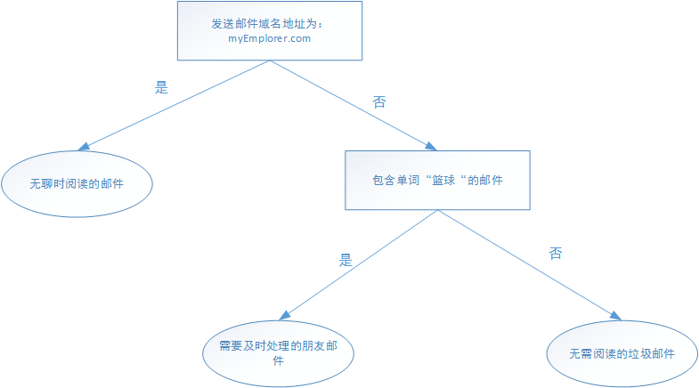

##决策树##

如下所示的流程长是一个简单的决策树执行流程，其中长方形代表判断模(decision block)，椭圆形代表终止模块(teriminating block)，表示已经得出结论，可以终止运行。从判断模块引出的左右箭头称作分支(branch)，它可以到达另外一个判断模块或者终止模块。下图中是一个假想的邮件分类系统，他首先判断接收到的邮箱名称是否来自 myEmployer.com 这个域名，如果是就将该邮件归类为“无聊时阅读的邮件”，否则检测邮件中是否包含“篮球”这个关键字，如果包含则将该邮件归类为“需要及时处理的朋友邮件”，否则将该邮件归类为“无需阅读的垃圾邮件”。

